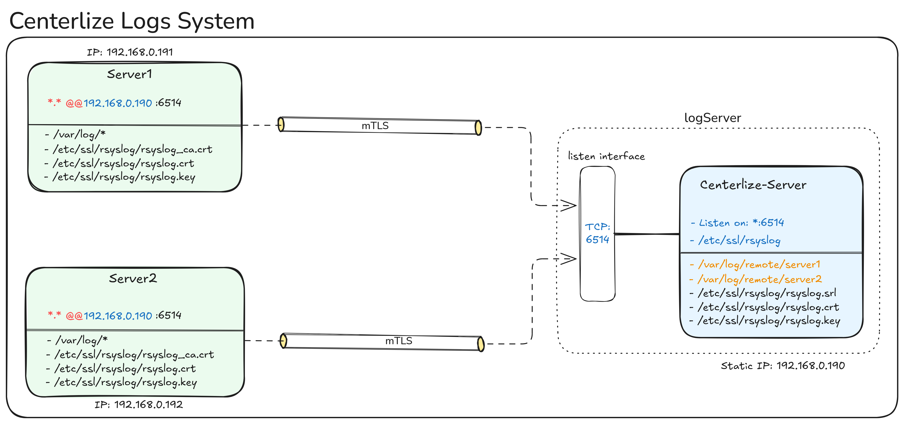
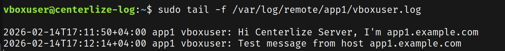
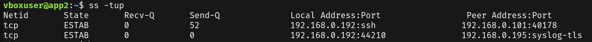

# Centerlize Logs into One Server Using Rsyslog

This repository provides a step-by-step guide to centralize logs
from multiple servers into a single server using Rsyslog,
centralizing logs can help in better monitoring, analysis, and troubleshooting of your systems under one roof.

## Daigram



---

## Prerequisites

- A central log server (Rsyslog server) with a static IP address.
- Multiple client servers (Rsyslog clients) that will send their logs to the central server.
- Rsyslog installed on both the server and client machines.
- Ansible installed on the machine from which you will run the playbook.
- Proper SSH access to all servers for Ansible to execute the playbook.

## Steps to Deploy

- Run the playbook

```bash
ansible-playbook rsyslog.yml
```

## Test After Deployment

- From client server

```bash
logger "HELLO FROM $(hostname)"
```

- On the central log server, check if the log message is received:

```bash
ls -l /var/log/remote/
```

## Troubleshooting

- Check Rsyslog service status on both server and client machines:

```bash
systemctl status rsyslog
```

- Check Rsyslog log files for any errors or warnings:

```bash
tail -f /var/log/syslog
```

- Check opened ports on the server:

```bash
netstat -tuln | grep 514
```

---

## Secure Rsyslog with TLS

### Ensure the client treats this cert as a trusted root CA `CA:TRUE`

```bash
 openssl req -new -x509 -days 365 -nodes
    -newkey rsa:2048
    -out /etc/ssl/rsyslog/rsyslog.crt
    -keyout /etc/ssl/rsyslog/rsyslog.key
    -subj "/CN=log.example.com"

    -addext "basicConstraints=critical,CA:TRUE"
```

### Debug the TLS connection from the client to the server

- from the client, use openssl s_client to test the TLS connection to the server:

```bash
openssl s_client -connect 192.168.0.195:6514 -CAfile /etc/ssl/rsyslog/rsyslog.crt | less
```

### Check rsyslog configuration for syntax errors

```bash
sudo rsyslogd -N1
```

### On the client, check if the connection to the server is established

```bash
sudo ss -tnp | grep 6514
```

---

## Screenshots





---

## Future Improvements

- Implement log rotation and archiving on the central log server to manage disk space effectively.
- Set up alerting and monitoring for specific log events using tools like Logwatch or ELK
- Integrate with a log analysis tool for better insights and visualization of log data.
- Implement a backup strategy for log data on the central server to prevent data loss.
- Covert the playbook to a role for better modularity and reusability across different projects.
- Send only usful logs to the central server by configuring filters on the client side to reduce noise and improve log management.
- Configuring log Server to received only from known clients by using Firewall rules.
- Let it support RHEL operating system as well.
